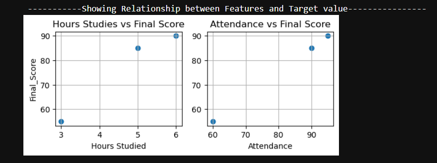
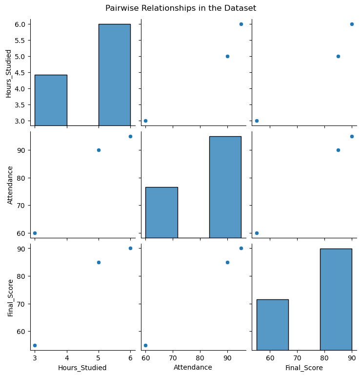
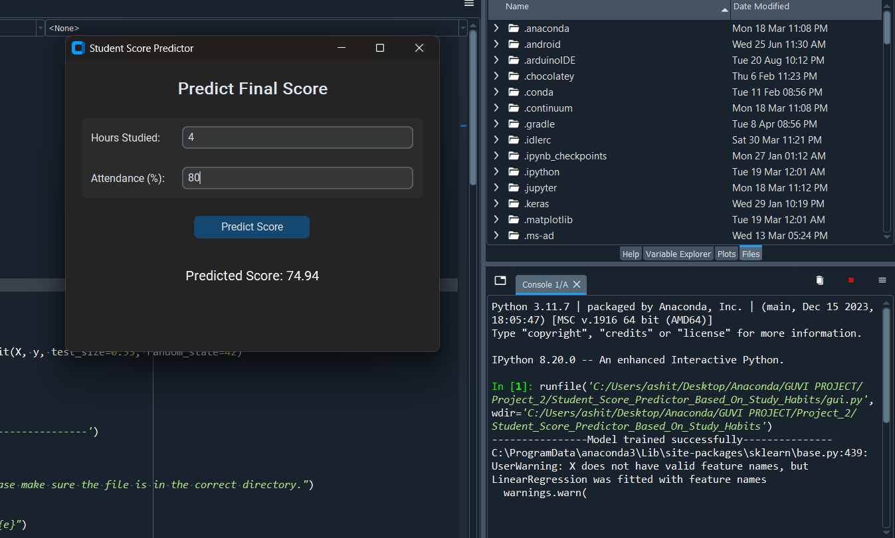
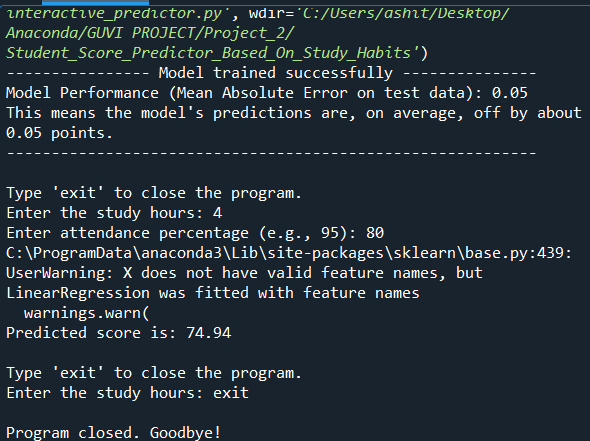
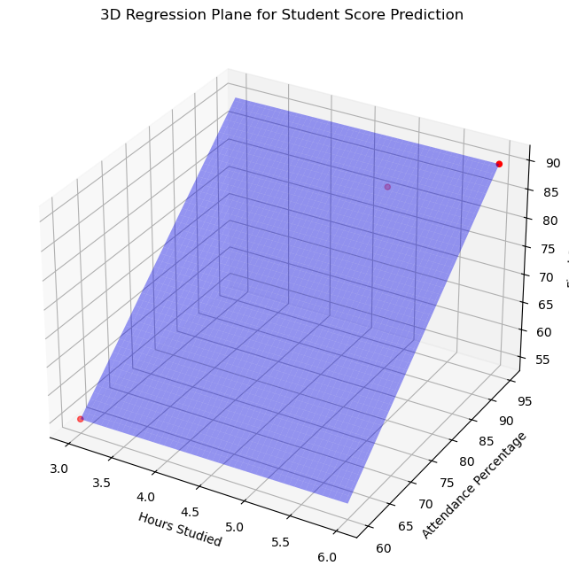
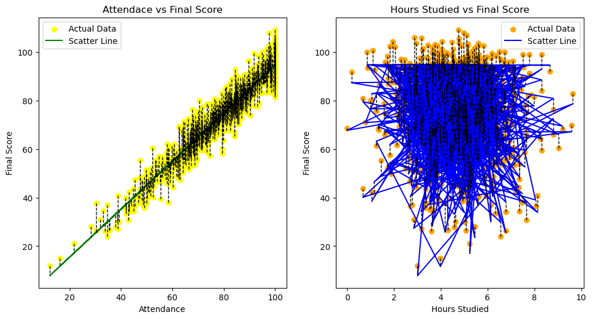

# Student_Score_Predictor_Based_On_Study_Habits
A simple Data Analysis project based on Linear Regression Machine Learning Model to predict the score of the student based on the study habits such as attendance and study hour

# 🎓 Student Score Predictor  

A machine learning project that predicts a student's final exam score based on their **study hours** and **class attendance percentage**.  

This repository includes:  
- 📒 Jupyter notebooks for analysis  
- 💻 An interactive command-line application  
- 🖥️ A graphical user interface (GUI) for easy use  

---

## 📋 Table of Contents  
- [Project Overview](#-project-overview)  
- [Features](#-features)  
- [Demo](#-demo)  
- [Screenshots](#-screenshots)  
- [Technologies Used](#-technologies-used)  
- [Setup and Installation](#️-setup-and-installation)  
- [Usage](#-usage)  
- [Code Highlights](#-code-highlights)  
- [Model Details](#-model-details)  
- [License](#-license)  

---

## 🚀 Project Overview  
This project demonstrates a complete **machine learning workflow** for a regression problem.  

It uses a **Linear Regression model** to predict a student's final exam score based on two features:  
- `Hours_Studied`  
- `Attendance (%)`  

The repository includes:  
- 📊 Data exploration & visualization  
- ⚙️ Model training and evaluation  
- 🖥️ CLI and GUI applications  

---

## ✨ Features  
- **Data Exploration & Visualization**: Scatter plots & pair plots using `matplotlib` and `seaborn`  
- **Machine Learning Model**: Linear Regression using `scikit-learn`  
- **Model Evaluation**: Metrics like R² Score and Mean Absolute Error (MAE)  
- **Interactive CLI**: Input study data in terminal → get predictions  
- **GUI Application**: User-friendly desktop app with `customtkinter`  

---

## 🖥️ Demo (GUI Example)  

```
+-------------------------------------------+
|         Student Score Predictor           |
+-------------------------------------------+
|           Predict Final Score             |
|                                           |
|  Hours Studied:   [ e.g., 4.5   ]         |
|  Attendance (%):  [ e.g., 85    ]         |
|                                           |
|           [ Predict Score ]               |
|                                           |
|        Predicted Score: 78.00             |
+-------------------------------------------+
```

---

## 📸 Screenshots  

### Data Visualization using Matplotlib  
  

### Data Visualization using Seaborn  
  

### GUI Running Example  
  

### CLI Running Example  
  

## 3D Regression Plane for Student Score Prediction

This plot shows the fitted regression plane for predicting student scores based on hours studied and attendance percentage.



## Plotting regression line for individual features

This plot shows the fitted regression line for attendance and hours studied featueres separately.




---

## 🛠️ Technologies Used  
- **Python 3**  
- **Pandas** → Data manipulation  
- **Scikit-learn** → Machine Learning (Linear Regression)  
- **NumPy** → Numerical operations  
- **Matplotlib & Seaborn** → Visualizations  
- **CustomTkinter** → Modern GUI  

---

## ⚙️ Setup and Installation  

1. **Clone the Repository**  
```bash
git clone https://github.com/your-username/student-score-predictor.git
cd student-score-predictor
```

2. **Create and Activate a Virtual Environment (Recommended)**  
```bash
# Create the environment
python -m venv venv

# Activate on macOS/Linux
source venv/bin/activate

# Activate on Windows
.env\Scriptsctivate
```

3. **Install Dependencies**  
```bash
pip install -r requirements.txt
```

If `requirements.txt` is not available, create one with:  
```
pandas
scikit-learn
numpy
matplotlib
seaborn
customtkinter
```

---

## ▶️ Usage  

There are **3 ways** to use this project:  

### 1. Jupyter Notebook Analysis  
Run notebooks for step-by-step data exploration and model training:  
```bash
jupyter notebook Student_Score_Predictor.ipynb
```

### 2. Interactive Command-Line Predictor  
Run directly in terminal:  
```bash
python interactive_predictor.py
```
👉 Enter hours studied & attendance when prompted. Type `exit` to quit.  

### 3. GUI Application  
Launch GUI for easy predictions:  
```bash
python gui.py
```

---

## 💻 Code Highlights  

### 🔹 Model Training (from `interactive_predictor.py`)  
```python
# 1. Load data using pandas
df = pd.read_csv('student_scores.csv')

# 2. Define features (X) and target (y)
X = df[['Hours_Studied', 'Attendance']]
y = df['Final_Score']

# 3. Split the data
X_train, X_test, y_train, y_test = train_test_split(X, y, test_size=0.2, random_state=42)

# 4. Train the Linear Regression model
model = LinearRegression()
model.fit(X_train, y_train)

print("✅ Model training complete.")
```

### 🔹 GUI Prediction Logic (from `gui.py`)  
```python
def predict_score(self):
    try:
        # Get input
        new_hrs = float(self.hours_entry.get())
        new_attendance = float(self.attendance_entry.get())

        # Predict score
        predicted_score = model.predict([[new_hrs, new_attendance]])
        
        # Display result
        self.result_label.configure(text=f"Predicted Score: {predicted_score[0]:.2f}")

    except ValueError:
        self.result_label.configure(
            text="Invalid input. Please enter numbers only.", 
            text_color="red"
        )
```

---

## 🧠 Model Details  
- **Algorithm**: Linear Regression  
- **Features**:  
  - `Hours_Studied`  
  - `Attendance (%)`  
- **Target Variable**: `Final_Score`  
- **Dataset**: `student_scores.csv`  

---

## 📄 License  
This project is licensed under the **MIT License**.  

You are free to **use, modify, and distribute** this software with attribution.  
See the [LICENSE](LICENSE) file for details.  

---
